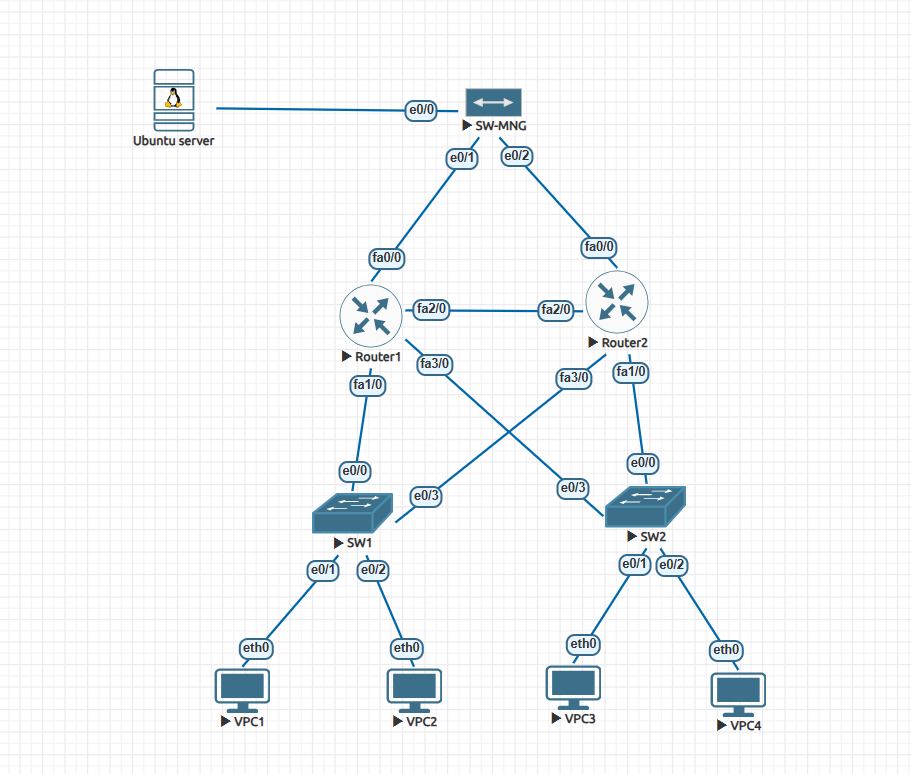

# Network Automation & Security Provisioning Lab 🚀

## 📌 Project Overview
This project focuses on automating network management and enhancing security within a Cisco-based infrastructure. By integrating **Python** and **Ansible**, the lab demonstrates an **Infrastructure as Code (IaC)** approach to handle daily operations and dynamic security policies efficiently without manual CLI intervention.

## 🖼 Network Topology


## ✨ Core Features
* **Dynamic Security Enforcement (Ansible):** Implemented **Time-Based ACLs** via Ansible playbooks (`block_time.yml`) to automatically restrict inter-network traffic based on scheduled business hours.
* **Automated Backups (Python):** Developed a **Python script** (`backup_network.py` using Netmiko) to perform daily configuration backups, saving running-config snapshots of each device to a centralized directory (`/backup_configs`).

## 🛠 Tech Stack
* **Automation Tools:** 
  * **Ansible:** Security provisioning and ACL deployment.
  * **Python (Netmiko):** Automated device backups.
* **Infrastructure:** Cisco IOS.
* **Platform:** EVE-NG, Ubuntu Server.

## 📂 Project Structure
```text
├── Topology/           # Network diagram
│   └── Topology.png
├── ansible/            # Ansible automation files
│   ├── ansible.cfg     # Ansible configuration
│   ├── block_time.yml  # Playbook for Time-Based ACL deployment
│   └── hosts.ini       # Inventory file
├── backup_configs/     # Sample outputs of automated backups
├── python/             # Python scripts
│   └── backup_network.py
└── README.md           # Project documentation

🚀 Quick Start
Clone the repository:
git clone [https://github.com/duydn4804/Network-automation-lab.git](https://github.com/duydn4804/Network-automation-lab.git)
cd Network-automation-lab

Install required Python library:
pip install netmiko

Run Ansible Playbook (Deploy Time-Based ACLs):
ansible-playbook -i ansible/hosts.ini ansible/block_time.yml

Run Python Backup Script (Fetch Configurations):
python3 python/backup_network.py
